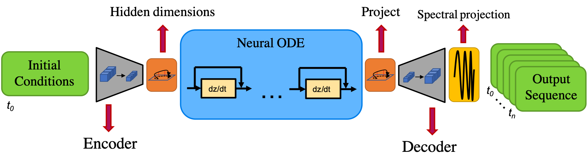

# ConvNeuralODE

This repository houses the code from: https://arxiv.org/abs/2110.11528

The paper outlines a methodology for forecasting isotropic turbulence via convolutional layers in a NeuralODE framework.

A general schematic of the architecture is shown here.

